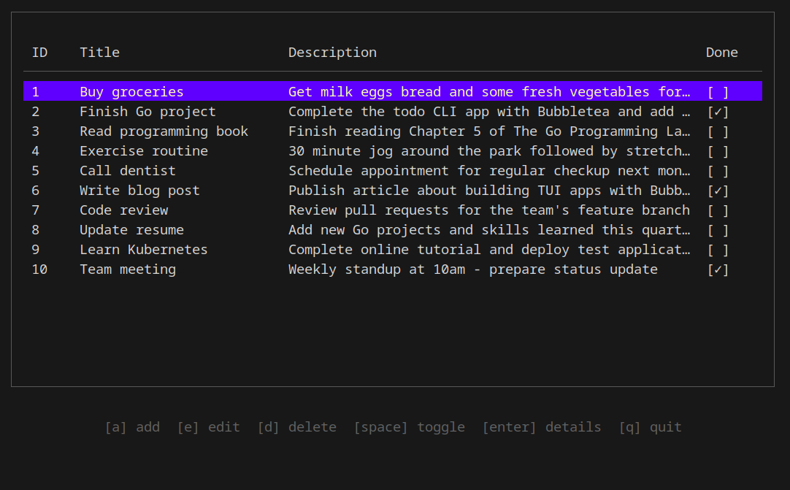
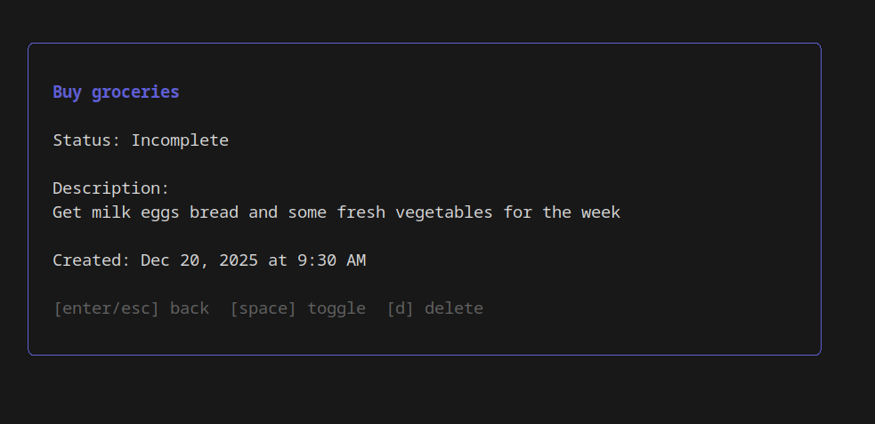

# Todo CLI

A beautiful terminal-based todo application built with Go and [Bubbletea](https://github.com/charmbracelet/bubbletea). Manage your tasks with full CRUD functionality and persistent CSV storage.


## Features

- **Full CRUD Operations** - Create, Read, Update, and Delete todos
- **Persistent Storage** - All todos saved to CSV file in `~/Documents/todos.csv`
- **Interactive TUI** - Beautiful terminal user interface with keyboard navigation
- **Detail View** - Popup window showing full todo information
- **Task Completion** - Toggle tasks as complete/incomplete
- **Multi-line Descriptions** - Support for detailed todo descriptions
- **Filtering** - Filter between All, Completed, and Active todos

## Installation

### Prerequisites

- Go 1.16 or higher

### Quick Install (Recommended)

Install directly from GitHub using `go install`:

```bash
go install github.com/zachkp/todo@latest
```

This will download, build, and install the binary to `$GOPATH/bin` (usually `~/go/bin` on Linux/macOS or `%USERPROFILE%\go\bin` on Windows), which is automatically in your PATH if Go is properly configured.

**Windows Note:** If the command isn't found after installation, you may need to add Go's bin directory to your PATH:
```powershell
# In PowerShell, add this to your profile or run it once:
$env:PATH += ";$env:USERPROFILE\go\bin"
```

### Build from Source

```bash
git clone https://github.com/zachkp/todo.git
cd todo
go build -o todo
```

### Install to PATH

**Using Make:**

```bash
# Build and install to ~/.local/bin
make install

```

**Manual Installation:**

```bash
# Build the binary
make build

# Copy to a directory in your PATH
sudo cp todo /usr/local/bin/

# Or for user-only installation
mkdir -p ~/.local/bin
cp todo ~/.local/bin/
export PATH="$HOME/.local/bin:$PATH"  # Add to ~/.bashrc or ~/.zshrc

# For fish shell users
fish_add_path ~/.local/bin
```

## Usage

Simply run:

```bash
todo
```

### Keyboard Controls

#### Main Table View

| Key | Action |
|-----|--------|
| `a` | Add new todo |
| `e` | Edit selected todo |
| `d` | Delete selected todo |
| `space` | Toggle completion status |
| `enter` | View todo details |
| `↑/↓` | Navigate through todos |
| `q` or `ctrl+c` | Quit application |

#### Detail View

| Key | Action |
|-----|--------|
| `enter` or `esc` | Back to table |
| `space` | Toggle completion |
| `d` | Delete todo |

#### Add/Edit View

| Key | Action |
|-----|--------|
| `ctrl+s` | Save todo |
| `tab` | Switch between title and description |
| `esc` | Cancel and return to table |

## Screenshots

### Main Table View



### Detail View



## Data Storage

Todos are stored in a CSV file at `~/Documents/todos.csv` with the following structure:

```csv
ID,Title,Description,Completed
1,Buy groceries,Get milk eggs bread,false
2,Finish project,Complete the Go todo app,true
```

The file is automatically created on first run and persists across sessions.

## Dependencies

- [bubbletea](https://github.com/charmbracelet/bubbletea) - TUI framework
- [bubbles](https://github.com/charmbracelet/bubbles) - TUI components (table, textarea, textinput)
- [lipgloss](https://github.com/charmbracelet/lipgloss) - Style definitions for TUI

## Development

### Run without installing

```bash
go run main.go
```

### Build

```bash
go build -o todo
```

### Dependencies

```bash
go mod download
```

## Contributing

Contributions are welcome! Please feel free to submit a Pull Request.

## License

MIT License - feel free to use this project however you'd like.

## Acknowledgments

Built with the amazing [Charm](https://charm.sh/) TUI libraries.
